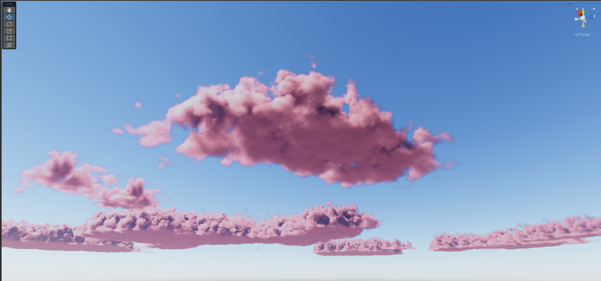
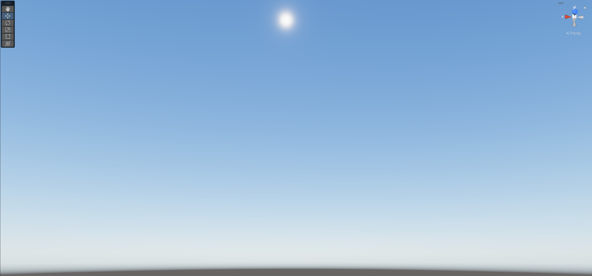
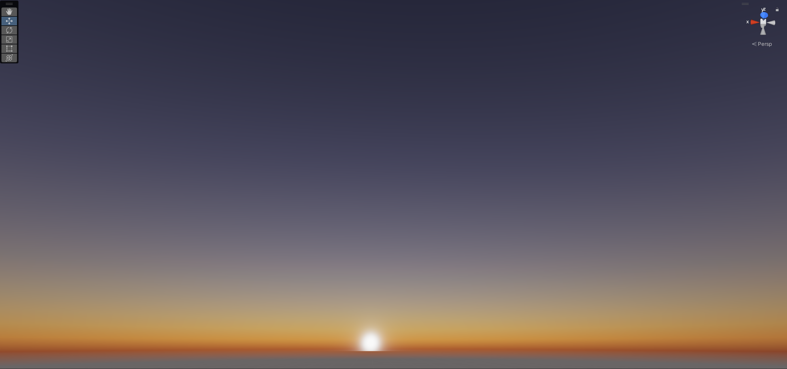
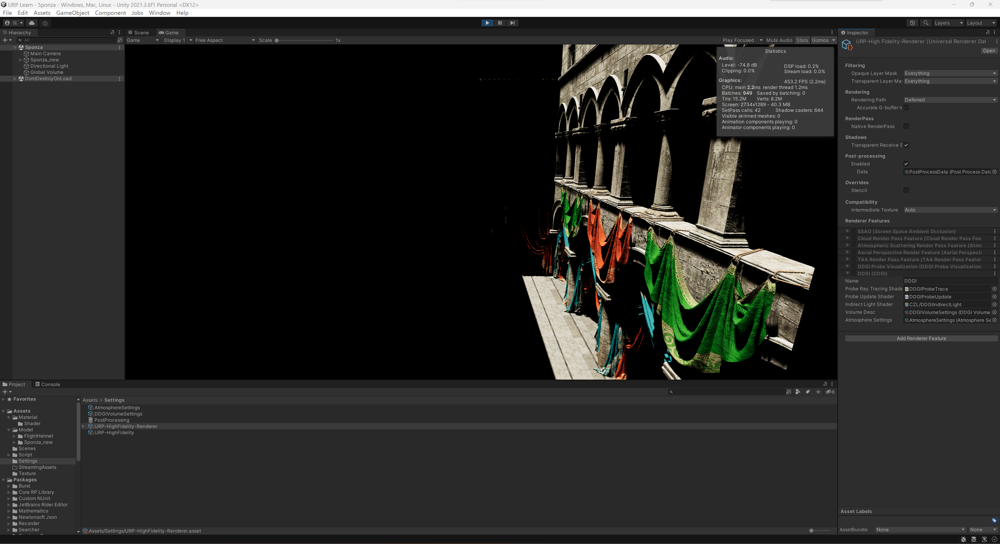

# URP Learn
Unity URP Learning Project  

## Required 
Unity 2021.3.6f1  
URP 12.1.7  
RTX GPU
## RayMarchingCloud

feature
- WeatherTexture for Cloud Modeling
- FBM Noise
- Powder Effect
- Ambient Light
- Approximate Multiple Scattering
- Fog Fade
- BlueNoise

reference  
- https://github.com/qiutang98/flower  
- https://qiutang98.github.io/post/%E5%AE%9E%E6%97%B6%E6%B8%B2%E6%9F%93%E5%BC%80%E5%8F%91/%E5%AE%9E%E6%97%B6%E4%BD%93%E7%A7%AF%E4%BA%91%E6%B8%B2%E6%9F%93/
- https://zhuanlan.zhihu.com/p/440607144

video in **Recordings/RayMarching.mp4**
## Atmosphere

feature
- Transmittance Lut
- AtmosphericScattering Lut
- MultiScattering Lut
- AerialPerspective

reference  
- https://zhuanlan.zhihu.com/p/595576594
- https://www.alanzucconi.com/2017/10/10/atmospheric-scattering-1/
- https://zhuanlan.zhihu.com/p/127026136

video in **Recordings/Atmosphere.mp4**
## DDGI

feature
- Custom URP Lit for Raytracing Hit Shader
- Probe Visualization
- Dynamic Realtime GI

reference  
- https://github.com/NVIDIAGameWorks/RTXGI
- https://github.com/MartinMisiak/URP-VR-Raytracing

Scene:链接：https://pan.baidu.com/s/1ZpRZ8DagZF_pxBAs0BClBw?pwd=12xm  
提取码：12xm 

video in **Recordings/DDGI.mp4**